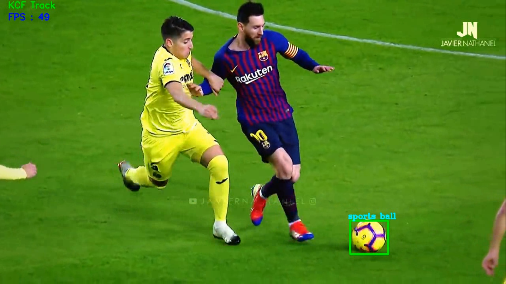
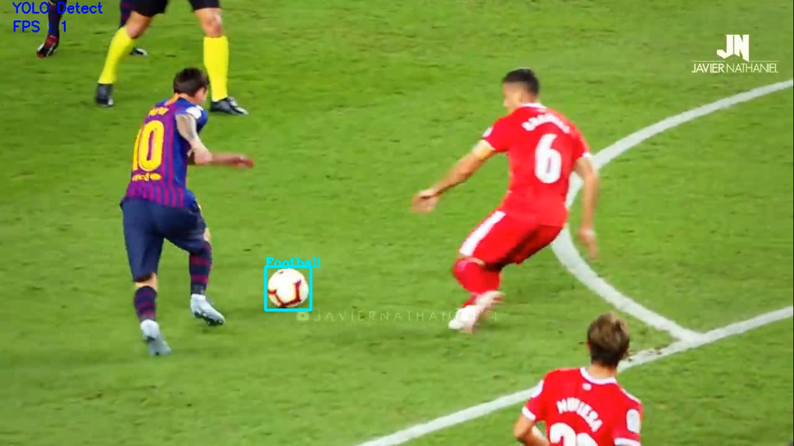
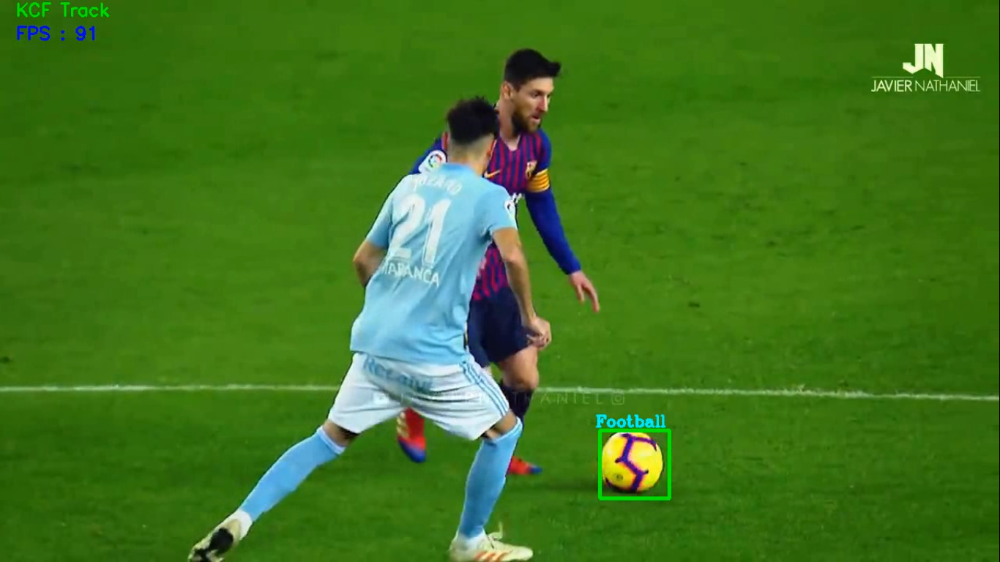
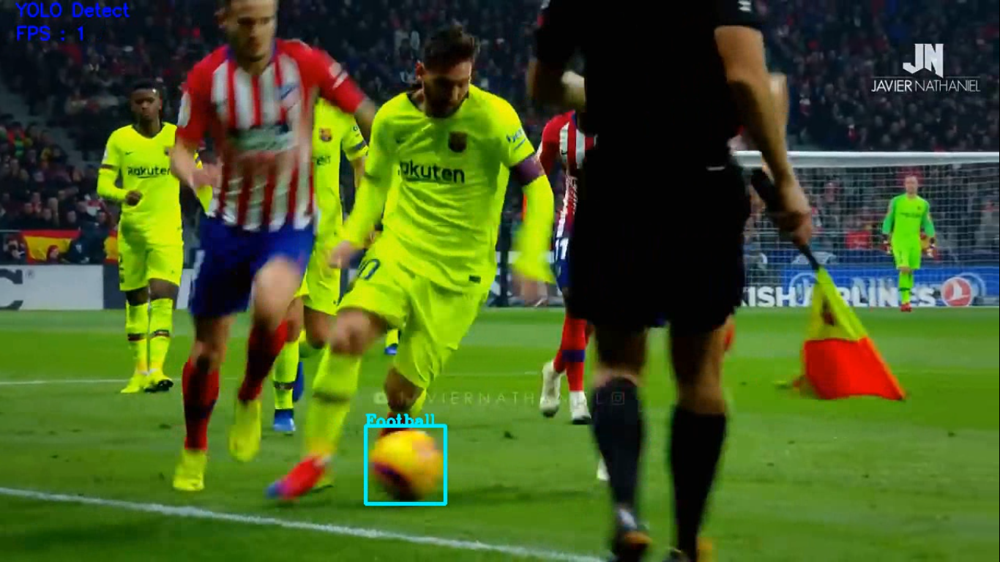

# YOLOv3-KCF-Fast-Object-Tracker
A fast object tracking pipeline that uses a combination of YOLO's accurate detection and KCF's fast tracking to track a particular object from the Coco dataset

YOLO object tracking is extremely slow when it comes detecting object in videos or in real-time using a camera feed. This projects aims at improving the tracking speed. This project is implemented with soccer balls but can be used easily for another object tracking application.

## Requirements:-
- Python3
- OpenCV (with highGUI install for real-time output)
- YOLOv3 trained weights (available [here](https://pjreddie.com/media/files/yolov3.weights))
- YOLOv3 config file (available in repo or [here](https://github.com/pjreddie/darknet/blob/master/cfg/yolov3.cfg))
- Coco dataset class labels list (available in repo)

## How to run script
In your command line(with installed libraries) type " python tracker.py --video (path to input video) ". Use python3 command if thats how you access python version 3.

I have also added an optional --object flag in case you want to change the type of object to be detected in the video. BY DEFAULT THE OBJECT DETECTED WILL BE A SOCCER BALL/ FOOTBALL/ ANY SPORTS BALL. Refer to the coco dataset names for a whole list of objects that can be tracked and make sure to use the same name in the command line argument

Preferably make sure that only one object of a kind is present in a video. The code cannot properly track multiple instances of the same object. 

An output video will automatically be created in the same directory where the script was run from.

**PLEASE NOTE THAT THE VIDEO SPEED RECIEVED DURING HIGHGUI OUTPUT IS PURELY BASED ON THE LOCAL MACHINE'S COMPUTATIONAL POWER LIKE CPU/GPU**

**YOU CAN USE THE 'q' KEY ON THE KEYBOARD AT ANYTIME TO TERMINATE THE SCRIPT AND CLOSE ANY HIGHGUI WINDOWS** 

## Methodology 
I am using the OpenCV's dnn module as an inference engine as it is many times faster than other inference engines like Keras or TensorFlow since it is built on c++ optimized library. 

But even with that the inference is slow on videos so I decided to use object trackers that are built into OpenCV to speed up the process. I am using a *Kernelized Correlation Filter (KCF)* because it works very well under a tight crop object bounding box as given by the YOLOV3. 

In conjunction I am using a YOLO detector to first detect the object in one frame of the video and next track it across multiple frames using KCF. When there is occlusion or scale change of any kind, its highly likely that the KCF will fail. At that moment YOLO detector is used to reestablish the bounding box around the object and KCF is reinitialized to track the object again. 

When KCF tracks the object the speed of tracking is drastically improved as seen by the fps counter. So where YOLO only trackers take nearly 7 mins to process a single minute of video for tracking, a combination of YOLO detection and KCF tracking takes just 4 minutes.

## Outputs
**Please read the readme file in the output folder for rights issues** 

   
 
